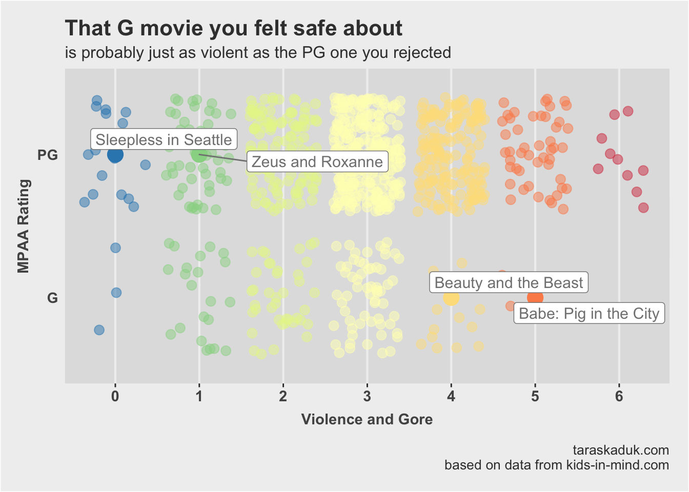
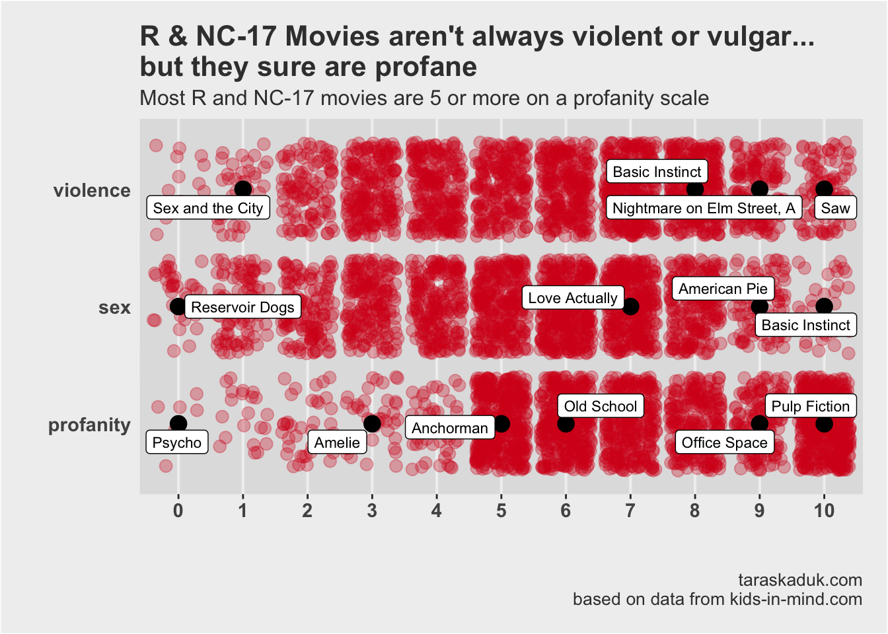

Being a parent in modern days is lots of fun. Not only all of us are pretty much winging it, not having any idea what we’re doing *(seriously, you need a license to do braids and nails, yet raising a human being a future member of society is a no-brainer, right?)*  — we are also constantly being watched and judged by other parents.

When it comes to watching movies with our six-year-old son, we don’t have a strict set of rules. We pretty much fly by the seat of our pants with *“I know it when I see it”* approach to violence, profanity, or any other content. Not to say that we’re watching Pulp Fiction and Basic Instinct (the most challenging movie to date was probably Alice in the Wonderland), but all the movies we watch with our son are between G and PG - and we hardly can tell a difference between the two.

That’s why I was surprised to find out that some parents swear by this MPAA rating system, and use it religiously when deciding what their kids can and can’t watch.

And it’d be all good if I haven’t noticed that these ratings are sometimes kind of… *arbitrary?* So, I decided to dig into the data. Because data will solve all of our problems, right?

# The Data
I searched around a bit, and stumbled upon a few awesome things. First, apparently [imdb.com](http://www.imdb.com/) has a parental section for every  movie. However, these guides are not standard in the way they are filled out, and scrubbing IMDb for this data wouldn’t get me where I wanted to be fast enough. And then I stumbled upon this awesome website called [kids-in-mind.com](http://kids-in-mind.com). It had a lot of info similar or equal to one contained on [IMBd.com](http://www.imdb.com/), but it had a crucial key component: every movie on this website is rated on an 11-point scale, from 0 to 10, on three metrics: **sex & nudity**, **violence & gore**, and **profanity**. Well, this is just perfect! Not only that — it also has that MPAA rating data point for every movie, which means I get all of my data in one sitting.

So, I wrote a little R script using `rvest` package, and got my data into a tidy data frame, and started exploring. After a little bit of data wrangling (I excluded **NR** movies as they are obviously *not rated*, and are all over the place. Also, Kids In Mind database didn't have many **NC-17** rated movies, therefore I combined them with **R** rated films), I got my first results.

# Results

### On average, higher MPAA rating follows higher levels of inappropriate content, but...
The first result seemed fairly obvious: higher (stricter) MPAA ratings have a higher rate of violence, sex and profanity. **On average**. However, the amount of overlap is astonishing. Basically, any category is entirely consumed by its two neighboring categories. 

What's more, you can always find a movie in a "lower" category that is more inappropriate than some other movie in a "higher" category: Jimmy Neutron VS Little Rascals, the 5th Harry Potter VS Life is Beautiful, Year One VS The King's Speech etc.

You can see this from the figure below. You may also notice that there movies scoring 2.5 points on average that are in every MPAA category. We'll come back to this later.

### MPAA is most forgiving on violence
Well, no kidding! This was hardly a surprise. As a foreigner, I am constantly amused by how much violence is considered appropriate, contrasted with, for example, how little nudity is acceptable. *Guts and blood? Body parts?* **Sure, bring it on!** *Naked breasts?* **How dare you!**

So, next time you rent a G rated movie and think it is clean - think again. It's probably just as violent as that other PG movie you wanted. Both G and PG movies center around 3 points on violence anyway, with max points being 5 for G and 6 for PG. Just go with PG then, eh?

### What the **** is up with profanity?
Now, this is a zero tolerance zone in the movie world. Not sex and nudity, as I assumed. Profanity. Unlike other categories, where scores flow gradually from category to category, profanity has some clear trends:

 - All G movies are bundled up in a narrow 0-2 points corridor
 
 - Most PG-13 movies are between 4 and 5 points on profanity
 
 - R and NC-17 movies reside between 5 and 10 points

I bet if I was trying to predict an MPAA rating based on these criteria, profanity would be the strongest predictor (not a concern of this post, but maybe later)

Looking at R & NC-17 section, it is tempting to dive in a bit more. Let's go!

Indeed, movies in R & NC-17 categories are widely distributed across violence and sex, but snuggle tightly in the upper section of profanity. Why is that? Looking at the data, we can tell that often profanity accompanies other "R" worthy content. However, it is not always the case, and correlation is relatively weak. <a id="quote">Good Will Hunting is neither violent nor sexually explicit, but it is profane AF, and, sure enough, is R rated for - wait for it - *"strong language, including some sex-related dialogue".* </a>
It could be just me (after all, I am a foreigner, and English words don't carry the same connotation for me), but I think it is mighty unfair to Good Will Hunting to be rated R, especially knowing that Scary Movie, parts 3 through 5, are rated PG-13.

# Summary

So, what have we learned?

- It is probably OK to use MPAA ratings as a guide
- If you're optimizing for lack of violence, G and PG movies aren't that much different, therefore don't worry much.
- R rating doesn't mean the movie is violent or has a lot of sexual content. But it definitely means there is some profanity in it!

# Caveats

It is important to remember that any rating will be arbitrary a priori. We aren't working with exact count of swear words, time duration of violent scenes, or percentage of naked body revealed. And [kids-in-mind.com](http://kids-in-mind.com) rating isn't perfect either. For example, the website rates Pulp Fiction at 10 on a "sex & nudity" scale, while there is hardly any sexual content in the movie.

# Outro

This post was nothing but an exercise in `rmarkdown`, `blogdown`, `ggplot` and `rvest` packages, along with honing my data storytelling and writing skills though. I am sure if I torture this dataset a bit more, it may confess to many other things. So, I will wrap up for now, but plan to return to this topic and this dataset in the future. Let me know if there are any specific questions that come to your mind for this dataset!

### R script
This site runs on ~~dunkin~~ `blogdown`, and therefore all the source files are available on GitHub. Now, I must be honest: I am new to Github, to Hugo, and to the web in general. I have very little idea about what I'm doing. But I guess here is the link? https://github.com/taraskaduk/taraskaduk/tree/master/content/post/movies (unless I change something or screw it up big time, in which case throw rocks at me in the comment section)