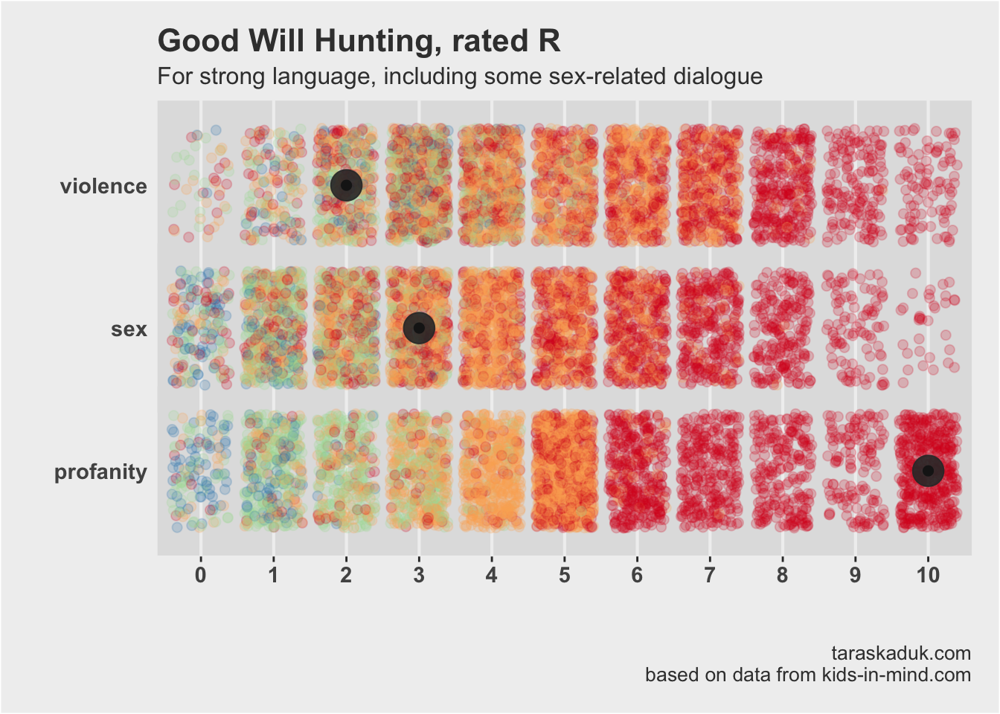

About a month ago, I wrote a little article about the MPAA rating system. I set up to find out if their lettering system does any justice to the actual content seen on the screen. Briefly speaking, it does, but with caveats.

One of such caveats was the effect of profanity. What my quick and dirty data analysis showed was that profanity was the sure thing that could send a movie into an R category:

I even wrote this in my [blog post](/post/mpaa/mpaa/#quote), when summing up the effects of profanity on movie's rating:

> Good Will Hunting is neither violent nor sexually explicit, but it is profane AF, and, sure enough, is R rated for - wait for it - *"strong language, including some sex-related dialogue".*

## When Matt Damon proves you right

So, a few days ago we were watching **The Late Show with Stephen Colbert**, and this bit with Matt Damon caught my instant attention:

> I remember when people at MIRAMAX came to us and said 
> _"Could you make it [Good Will Hunting] **PG-13?**"_ There’s no violence or sex to speak of, it’s just…
>
> And I said _"What’s making it rated **R**?"_, 
>
> and they said _“the language”_,
>
> and I said _“Okay well so we could loop a couple lines”_, 
>
> and they go _"Yeah but you’re only allowed"_ … I think at the time you were allowed to say the **F-word** three times... 
>
> and I said _“Okay, well how many are we off by?”_ 
>
> And they said _“You go over by a hundred and forty-five”_

 
<iframe width="560" height="315" src="https://www.youtube.com/embed/2GrKY7Qqal8?start=220&end=305" frameborder="0" allow="autoplay; encrypted-media" allowfullscreen></iframe>

Ha! So, my theory checks out! It’s profanity that makes a movie R rated! It can be puritan and pacifistic, but you drop a couple of F-bombs — and you’re out.

It is funny that I chose exactly Good Will Hunting as an example of how an otherwise modest movie can be sent straight to the R bench for what Matt claims is how they all talk in Boston.

***

Well, anyway, that’s it folks. Do more data analysis, for work and for fun.

